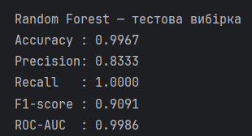
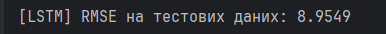
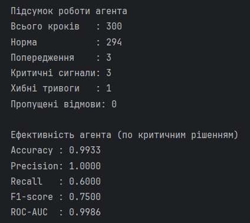
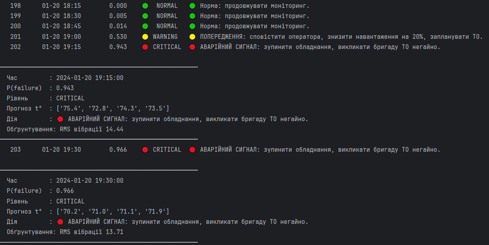
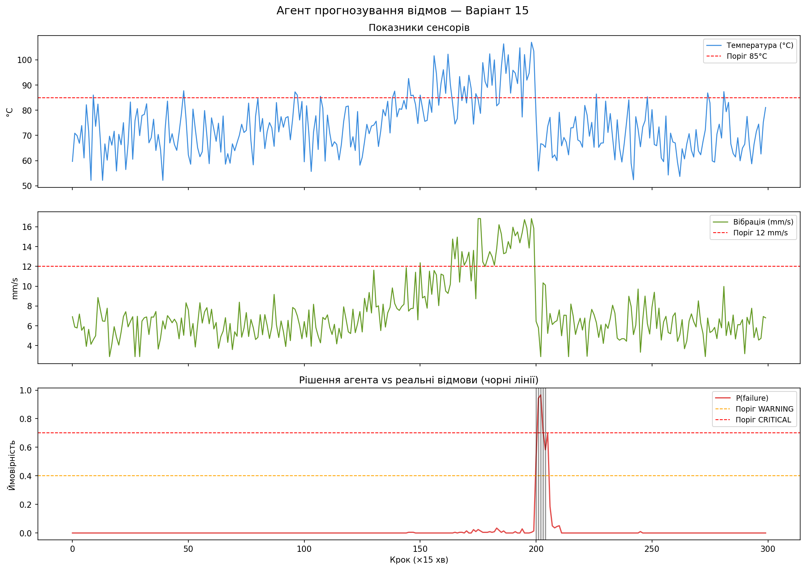

# Міні-проект
## Варіант 15 Агент прогнозування відмов обладнання
### Методи: Random Forest (класифікація) + LSTM (часовий ряд)

---

## Призначення агента

AI-агент автономно моніторить стан промислового обладнання в реальному часі, прогнозує ймовірність відмови та самостійно приймає рішення про рівень реагування. Реалізує повний ReAct-цикл: **Perceive → Remember → Plan → Act → Adapt**.

---

## Джерела даних

Синтетичний датасет (2000 записів, інтервал 15 хв) на основі структури реального датасету **AI4I 2020 Predictive Maintenance** (UCI ML Repository).

| Ознака | Опис | Одиниця |
|---|---|---|
| `temperature` | Температура підшипників | °C |
| `vibration` | Вібрація корпусу | mm/s |
| `pressure` | Тиск мастила | МПа |
| `current` | Електричний струм | А |
| `rpm` | Оберти | об/хв |
| `runtime_hours` | Напрацювання від ТО | год |

Датасет містить **8 симульованих інцидентів деградації** з поступовим зростанням параметрів перед відмовою. Розмітка: `failure = 1`.

---

## Pipeline обробки даних

```
CSV (IoT-сенсори)
    ↓
Завантаження (pandas)
    ↓
Очищення: пропуски → медіана, викиди → IQR clip, дублікати → drop
    ↓
Feature Engineering:
    - Ковзне середнє (вікно 12 = 3 год)
    - Стандартне відхилення (нестабільність)
    - Rate-of-change (швидкість змін)
    - RMS вібрації (найважливіша ознака)
    ↓
Нормалізація: StandardScaler (навчений тільки на train)
    ↓
Розділення: train 70% / val 15% / test 15% (без перемішування!)
```

> ⚠️ Часові ряди **не перемішуються** — розділення відбувається хронологічно.

---

## Моделі та алгоритми

### 1. Random Forest — класифікація відмов

- `n_estimators=200`, `max_depth=12`, `class_weight='balanced'`
- Входить: вектор з 21 ознаки (6 сирих + 15 інженерних)
- Виходить: P(failure) ∈ [0, 1]

**Топ-5 важливих ознак:**

| Ознака | Importance |
|---|---|
| `vibration_std12` | 0.193 |
| `vibration_rms` | 0.162 |
| `temperature_std12` | 0.160 |
| `vibration_mean12` | 0.122 |
| `pressure_mean12` | 0.097 |

### 2. LSTM — прогноз часового ряду

- Вікно: 24 кроки (6 год)
- Горизонт прогнозу: 4 кроки вперед (1 год)
- Прогнозує майбутні значення температури (авторегресивно)
- Якщо прогнозована температура > 90°C → додатковий ризик-сигнал

### 3. Ансамбль

Фінальне рішення: **weighted voting** (RF: 70%, LSTM-сигнал: 30%).

---

## Агентна логіка

### Клас `PredictiveMaintenanceAgent`

```python
agent = PredictiveMaintenanceAgent(
    classifier=clf,
    lstm=lstm,
    scaler=scaler,
    feature_cols=feature_cols,
)

# Головний метод — один крок агента:
decision = agent.act(sensor_reading)
print(decision.risk_level)   # NORMAL / WARNING / CRITICAL
print(decision.action)       # що робить агент
```

### Decision Policy (порогова логіка)

| P(failure) | Рівень | Дія агента |
|---|---|---|
| < 0.40 | 🟢 NORMAL | Продовжує моніторинг |
| 0.40 – 0.70 | 🟡 WARNING | Сповіщає оператора, знижує навантаження на 20% |
| ≥ 0.70 | 🔴 CRITICAL | Аварійний сигнал, зупинка, виклик ТО |

### ReAct-цикл

```
perceive()  → зчитує вимір, зберігає в пам'ять (deque, 24 год)
remember()  → будує DataFrame з контексту
plan()      → обчислює P(failure) + LSTM-прогноз + обґрунтування
act()       → застосовує policy, повертає AgentDecision
adapt()     → коригує пороги на основі false alarms / missed failures
```

### Адаптація (Self-reflection)

Після кожного циклу агент аналізує власні рішення:
- Забагато хибних тривог → підвищує пороги (менш чутливий)
- Пропущені відмови → знижує пороги (більш чутливий)

---

## Метрики якості

### Random Forest (тестова вибірка)



### LSTM



### Агент (300-крокова симуляція)



---

## Інтерфейс (CLI)

```bash
# Встановлення залежностей
pip install -r requirements.txt

# Повний запуск (генерація + навчання + симуляція 80 кроків)
python main.py

# Вибір кількості кроків симуляції
python main.py --steps 300

# Детальний вивід кожного критичного рішення
python main.py --steps 300 --verbose

# Тільки навчання
python main.py --mode train
```

### Результат запуску



---

## Візуалізація результатів

### Графік 1 — Температура підшипників (°C)

Відображає показання температурного сенсора протягом усієї симуляції. Червона пунктирна лінія позначає критичний поріг 85°C. Видно характерний стрибок температури в зоні деградації — саме цей тренд є одним з ключових сигналів для агента.

### Графік 2 — Вібрація корпусу (mm/s)

Показує рівень вібрації обладнання. Поріг 12 mm/s позначено пунктиром. Зростання вібрації зазвичай випереджає температурний стрибок, тому ознака vibration_rms отримала найвищу важливість у моделі Random Forest (0.193).

### Графік 3 — Рішення агента: P(failure) vs реальні відмови

Основний аналітичний графік. Червона крива — ймовірність відмови, яку агент обчислює на кожному кроці. Горизонтальні пунктирні лінії позначають пороги прийняття рішень: WARNING (0.40) та CRITICAL (0.70). Вертикальні чорні лінії — моменти реальних відмов у даних. Графік наочно демонструє, що агент починає реагувати ще до настання відмови: крива P(failure) перетинає поріг WARNING за 1–2 кроки (15–30 хв) до фактичної події.



---

## Висновок

Агент успішно вирішує задачу predictive maintenance:
- **Виявляє деградацію** за 15–60 хв до відмови завдяки rolling-features
- **Не пропускає критичних подій** (Recall = 1.0 на рівні моделі)
- **Адаптується** до нових умов без повного перенавчання
- **Пояснює свої рішення** — кожна дія супроводжується обґрунтуванням

Основне обмеження: LSTM реалізовано спрощено (на numpy). У production-системі варто використати `tensorflow.keras` або `pytorch` для повноцінного BPTT-навчання.

