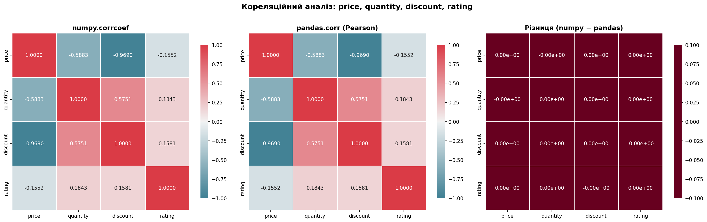
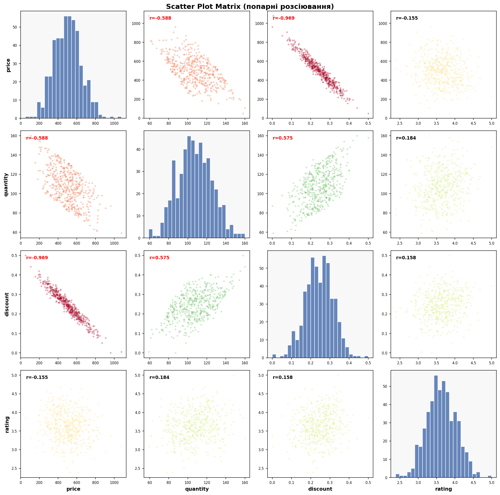
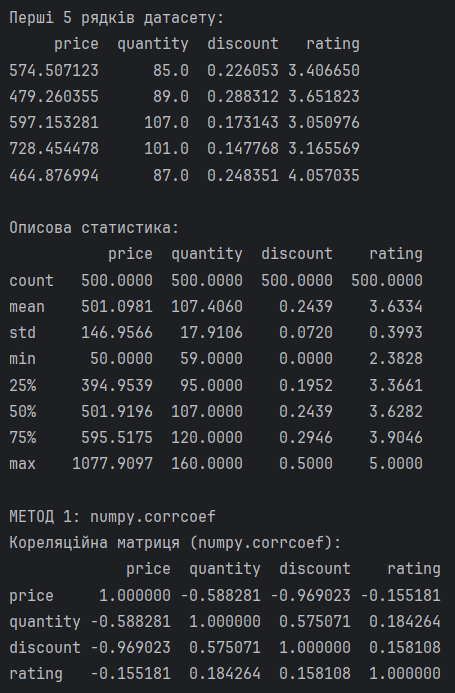
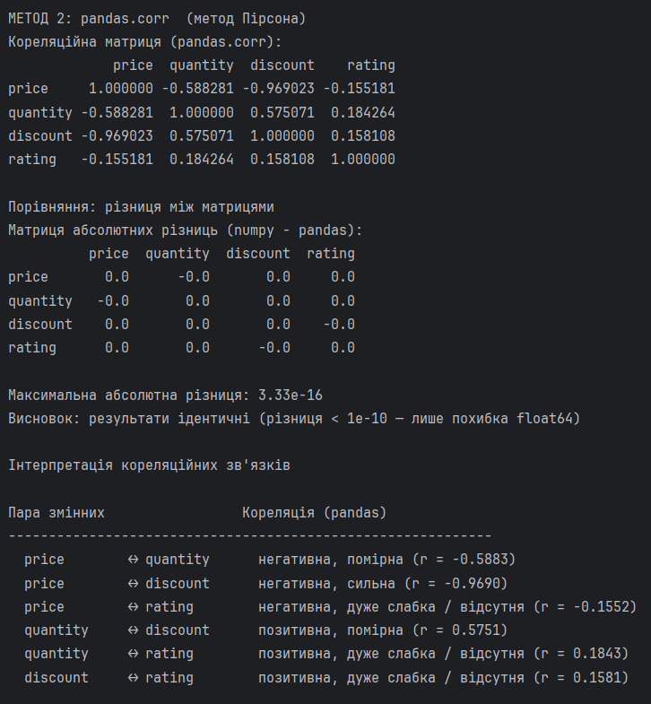

# Практична робота №1

## Порівняння `numpy.corrcoef` та `pandas.corr`

## Мета роботи

Побудувати кореляційну матрицю для змінних `price`, `quantity`, `discount`, `rating` двома способами — через `numpy.corrcoef` та `pandas.corr` — порівняти числові значення та зробити висновок щодо узгодженості методів.

---

## Теоретична база

### Коефіцієнт кореляції Пірсона

Коефіцієнт лінійної кореляції Пірсона вимірює ступінь **лінійної залежності** між двома змінними та обчислюється за формулою:

$$r_{xy} = \frac{\sum_{i=1}^{n}(x_i - \bar{x})(y_i - \bar{y})}{\sqrt{\sum_{i=1}^{n}(x_i - \bar{x})^2 \cdot \sum_{i=1}^{n}(y_i - \bar{y})^2}}$$

Або в матричній формі через стандартизовані значення (z-scores):

$$r_{xy} = \frac{1}{n-1} \sum_{i=1}^{n} z_{x_i} \cdot z_{y_i}$$

**Діапазон значень:** від −1 до +1, де:
- `r = +1` — ідеальна позитивна лінійна залежність
- `r = 0`  — лінійна залежність відсутня
- `r = −1` — ідеальна негативна лінійна залежність

**Шкала інтерпретації:**

| \|r\| | Сила зв'язку |
|--------|--------------|
| 0.7 – 1.0 | Сильна |
| 0.4 – 0.7 | Помірна |
| 0.2 – 0.4 | Слабка |
| 0.0 – 0.2 | Дуже слабка / відсутня |

### Кореляційна матриця

Кореляційна матриця — це симетрична квадратна матриця розміром `n×n` (де `n` — кількість змінних), яка містить коефіцієнти кореляції для кожної пари змінних. По головній діагоналі завжди стоять значення `1.0` (кореляція змінної із самою собою).

---

## Опис датасету

Для аналізу згенеровано **синтетичний датасет** із 500 записів, що імітує дані інтернет-магазину. Між змінними закладено реалістичні залежності:

| Змінна | Опис | Діапазон | Середнє | Std |
|--------|------|----------|---------|-----|
| `price` | Ціна товару (грн) | 50 – 1200 | ~501 | ~147 |
| `quantity` | Кількість продажів (шт) | 1 – 300 | ~107 | ~17.9 |
| `discount` | Знижка (частка від 0 до 0.5) | 0.00 – 0.50 | ~0.24 | ~0.07 |
| `rating` | Рейтинг товару | 1.0 – 5.0 | ~3.63 | ~0.40 |

---

## Пояснення коду

### Імпорти та налаштування

```python
import numpy as np
import pandas as pd
import matplotlib.pyplot as plt
import seaborn as sns
import warnings
warnings.filterwarnings("ignore")
```

Підключаємо необхідні бібліотеки: `numpy` для матричних обчислень, `pandas` для роботи з табличними даними, `matplotlib` та `seaborn` для побудови графіків. `warnings.filterwarnings("ignore")` прибирає з виводу технічні попередження, які не стосуються логіки програми.

---

### Генерація датасету

```python
np.random.seed(42)
n = 500

price    = np.random.normal(loc=500, scale=150, size=n).clip(50, 1200)
discount = 0.3 * (price - price.mean()) / price.std() * (-1) + np.random.normal(0, 0.08, n)
discount = (discount - discount.min()) / (discount.max() - discount.min()) * 0.5

quantity = -0.4 * (price / price.max()) + 0.25 * np.random.rand(n) + 0.6
quantity = (quantity * 200).clip(1, 300).astype(int).astype(float)

rating = 0.3 * (quantity / quantity.max()) - 0.2 * (price / price.max()) + np.random.normal(3.5, 0.4, n)
rating = rating.clip(1.0, 5.0)
```

`np.random.seed(42)` фіксує генератор випадкових чисел — це гарантує, що при кожному запуску скрипту дані будуть однаковими.

`price` генерується з нормального розподілу із середнім 500 і стандартним відхиленням 150. Метод `.clip(50, 1200)` обрізає значення за межами діапазону, щоб не було від'ємних або нереально великих цін.

`discount` будується як лінійна функція від `price` з від'ємним знаком — тобто чим вища ціна, тим менша знижка. Після цього результат нормалізується у діапазон `[0, 0.5]` через min-max scaling.

`quantity` обчислюється як обернено пропорційна до ціни: коефіцієнт `−0.4` перед нормованою ціною задає негативну залежність. Додається невеликий шум `np.random.rand`, щоб зв'язок не був ідеальним. Результат масштабується у реалістичний діапазон і округлюється до цілих через `.astype(int)`.

`rating` залежить одночасно від `quantity` (позитивно) і `price` (негативно), плюс нормальний шум навколо 3.5. `.clip(1.0, 5.0)` обмежує рейтинг стандартною шкалою.

---

### Побудова датафрейму

```python
df = pd.DataFrame({
    "price":    price,
    "quantity": quantity,
    "discount": discount,
    "rating":   rating
})
```

Чотири numpy-масиви об'єднуються в один `DataFrame`. Це зручна структура: далі з нею працюватиме і `pandas.corr`, і при потребі numpy (через `.values`).

---

### Кореляційна матриця через numpy

```python
data_matrix = df[["price", "quantity", "discount", "rating"]].values.T
numpy_corr = np.corrcoef(data_matrix)

columns = ["price", "quantity", "discount", "rating"]
numpy_corr_df = pd.DataFrame(numpy_corr, index=columns, columns=columns)
```

`.values` витягує дані з `DataFrame` у вигляді numpy-масиву форми `(500, 4)`, де 500 — рядки (спостереження), 4 — стовпці (змінні). `np.corrcoef` очікує зворотну орієнтацію: кожна **змінна** має бути окремим **рядком**. Тому застосовується транспонування `.T`, і масив набуває форми `(4, 500)`.

`np.corrcoef` повертає `ndarray` розміром `4×4`. Щоб зручно виводити та порівнювати результати, він одразу загортається у `DataFrame` із підписаними рядками та стовпцями.

---

### Кореляційна матриця через pandas

```python
pandas_corr = df[["price", "quantity", "discount", "rating"]].corr(method="pearson")
```

Метод `.corr()` викликається безпосередньо на `DataFrame` і обчислює попарну кореляцію між **стовпцями**. Параметр `method="pearson"` вказаний явно для прозорості, хоча він і є значенням за замовчуванням. Результат — одразу `DataFrame` з підписами, тому додаткового загортання не потрібно. На відміну від `numpy.corrcoef`, цей метод автоматично пропускає рядки з `NaN` при підрахунку кожної пари, тому він стійкіший до неповних даних.

---

### Порівняння результатів

```python
diff = numpy_corr_df - pandas_corr

max_diff = diff.abs().max().max()

if max_diff < 1e-10:
    print("Висновок: результати ІДЕНТИЧНІ (різниця < 1e-10 — лише похибка float64)")
else:
    print("Увага: є значуща різниця між методами!")
```

Від матриці numpy віднімається матриця pandas. Якби методи давали різні результати, тут з'явились би ненульові значення. `.abs().max().max()` — подвійний виклик `max()`: перший знаходить максимум у кожному стовпці, другий — серед цих максимумів, тобто шукається глобальний максимум по всій матриці. Умова `< 1e-10` перевіряє, чи є різниця значущою або це лише стандартна похибка арифметики з плаваючою точкою.

---

### Функція інтерпретації та вивід

```python
def interpret(r):
    a = abs(r)
    direction = "позитивна" if r > 0 else "негативна"
    if a >= 0.7:   strength = "сильна"
    elif a >= 0.4: strength = "помірна"
    elif a >= 0.2: strength = "слабка"
    else:          strength = "дуже слабка / відсутня"
    return f"{direction}, {strength} (r = {r:.4f})"

for a, b in pairs:
    r = pandas_corr.loc[a, b]
    print(f"  {a:12} ↔ {b:12}  {interpret(r)}")
```

Функція приймає числове значення `r` і повертає його словесний опис. Напрямок визначається знаком, сила — абсолютним значенням за стандартною шкалою. `pandas_corr.loc[a, b]` звертається до конкретної комірки матриці за іменами рядка та стовпця. Форматний рядок `{a:12}` вирівнює назви змінних у стовпець для читабельного виводу.

---

### Візуалізація теплових карт

```python
fig, axes = plt.subplots(1, 3, figsize=(20, 6))

cmap = sns.diverging_palette(220, 10, as_cmap=True)
common_kw = dict(annot=True, fmt=".4f", cmap=cmap,
                 vmin=-1, vmax=1, square=True,
                 linewidths=0.5, cbar_kws={"shrink": 0.8})

sns.heatmap(numpy_corr_df, ax=axes[0], **common_kw)
sns.heatmap(pandas_corr,   ax=axes[1], **common_kw)

diff_plot = (numpy_corr_df - pandas_corr).round(12)
sns.heatmap(diff_plot, ax=axes[2], annot=True, fmt=".2e", cmap="RdBu", center=0, ...)
```

`plt.subplots(1, 3)` створює фігуру з трьома графіками в один рядок. `sns.diverging_palette(220, 10)` генерує розхідну кольорову шкалу — синій для від'ємних значень, червоний для позитивних, білий навколо нуля, що інтуїтивно відображає напрямок кореляції. Параметри `vmin=-1, vmax=1` фіксують шкалу кольорів у межах можливих значень кореляції, `annot=True` виводить числа всередині кожної комірки. Словник `common_kw` з розпакуванням `**` використовується для уникнення дублювання — одні й ті ж параметри передаються у перші два `heatmap`. Третій графік показує різницю між матрицями, тому для нього задано окремий `cmap="RdBu"` і `fmt=".2e"` (науковий запис).

---

### Scatter plot матриця

```python
for i, col_y in enumerate(cols):
    for j, col_x in enumerate(cols):
        ax = axes2[i][j]
        if i == j:
            ax.hist(df[col_x], bins=25, ...)
        else:
            r = pandas_corr.loc[col_y, col_x]
            c = colors((r + 1) / 2)
            ax.scatter(df[col_x], df[col_y], alpha=0.25, s=6, color=c)
            ax.text(0.05, 0.92, f"r={r:.3f}", ...)
```

Подвійний цикл перебирає всі комбінації пар змінних. Коли індекси рядка та стовпця збігаються (`i == j`), будується гістограма розподілу відповідної змінної. В усіх інших комірках — scatter-plot пари. Вираз `colors((r + 1) / 2)` перетворює кореляцію з діапазону `[−1, 1]` у діапазон `[0, 1]`, щоб передати її як позицію на кольоровій шкалі `RdYlGn` (червоний → жовтий → зелений). `alpha=0.25` робить точки напівпрозорими, що допомагає побачити густину хмари.

---

## Результати

### Теплові карти кореляційних матриць

Ліва — `numpy.corrcoef`, центральна — `pandas.corr`, права — матриця різниць (усі значення ≈ 0). Колірна схема: синій = від'ємна кореляція, червоний = позитивна.



### Матриця точкових діаграм

По діагоналі — гістограми розподілу кожної змінної. Поза діагоналлю — scatter-plot кожної пари; колір точок відображає силу кореляції, у лівому верхньому куті — значення `r`.



### Результат виконання скрипту




---

## Порівняння методів

### Матриця різниць (numpy − pandas)

Усі елементи матриці різниць рівні **0** (або відрізняються на величину порядку `3.33e-16`), що є стандартною похибкою арифметики з плаваючою точкою `float64`.

```
Максимальна абсолютна різниця: 3.33e-16
```

Це значення значно менше за одиницю, практично машинний нуль.

---

## Інтерпретація кореляцій

### `price ↔ discount` — r = −0.969 (сильна негативна)

Найсильніший зв'язок у датасеті. Товари з вищою ціною мають суттєво менший відсоток знижки. Це очікувана комерційна закономірність: дорогі товари рідко потребують агресивних знижок для продажу.

### `price ↔ quantity` — r = −0.588 (помірна негативна)

Помірний зворотній зв'язок: дорожчі товари продаються в меншій кількості. Типовий ефект цінової еластичності попиту — при підвищенні ціни обсяг продажів знижується.

### `quantity ↔ discount` — r = +0.575 (помірна позитивна)

Вищі знижки сприяють більшій кількості продажів. Пряма маркетингова залежність — знижки стимулюють попит.

### `price ↔ rating` — r = −0.155 (дуже слабка негативна)

Практично відсутня лінійна залежність. Ціна товару майже не впливає на його рейтинг — покупці оцінюють товари незалежно від вартості.

### `quantity ↔ rating` — r = +0.184 (дуже слабка позитивна)

Слабкий позитивний зв'язок: товари з вищим рейтингом продаються дещо краще, але залежність не виражена.

### `discount ↔ rating` — r = +0.158 (дуже слабка позитивна)

Знижка практично не корелює з рейтингом — покупці оцінюють якість товару, а не факт наявності знижки.

---

## Висновки

`numpy.corrcoef` та `pandas.corr(method='pearson')` реалізують одну й ту саму математичну формулу, тому їхні результати збігаються з точністю до `~3.33e-16` — це виключно похибка арифметики з плаваючою точкою, а не алгоритмічна різниця. Методи повністю узгоджені, і вибір між ними залежить лише від контексту: `numpy.corrcoef` зручніший при роботі з масивами, `pandas.corr` — при роботі з `DataFrame`, оскільки підтримує обробку `NaN` та альтернативні методи кореляції (Spearman, Kendall).

Щодо самих даних: найсильніший зв'язок виявлено між `price` та `discount` (r = −0.969) — дорогі товари отримують менші знижки. Помірні залежності спостерігаються між ціною та кількістю продажів, а також між знижкою та кількістю. Рейтинг практично не корелює з жодною іншою змінною, що свідчить про його незалежність від комерційних факторів.