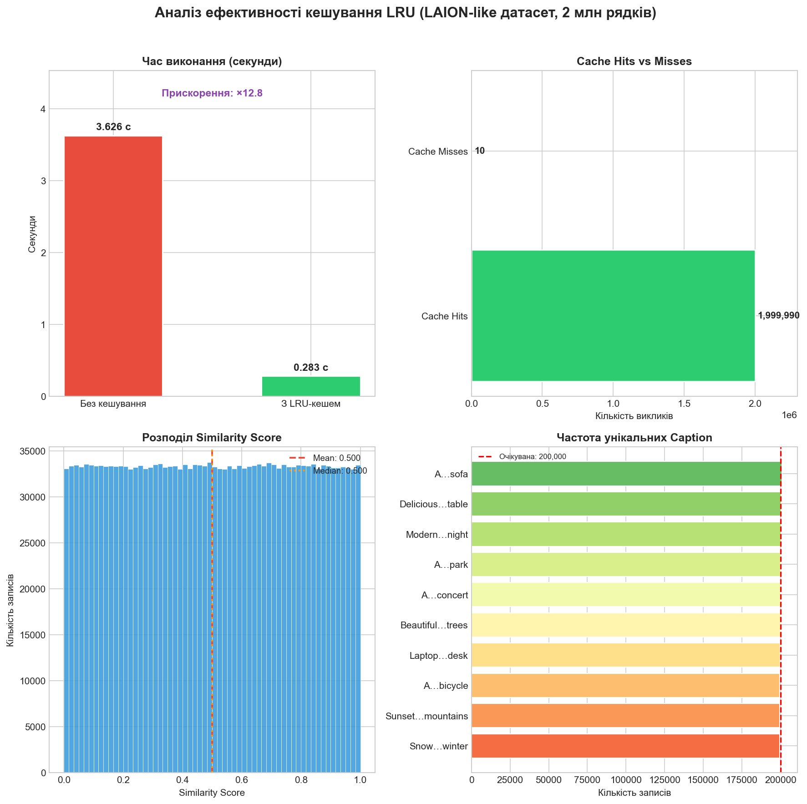

# Практична робота №2

## Варіант 15: Кешування `.apply()` при роботі з великими наборами даних

### Мета роботи

Дослідити проблему продуктивності методу `.apply()` при роботі з великими DataFrame та реалізувати кешування результатів функції за допомогою `functools.lru_cache`.

---

## Теоретичні відомості

### Кешування та `lru_cache`

**Кешування** (memoization) — це техніка оптимізації, при якій результати дорогих обчислень зберігаються в пам'яті та повертаються одразу при повторному виклику з тими самими аргументами, без повторного виконання функції.

`functools.lru_cache` — вбудований декоратор Python, що реалізує кеш за алгоритмом **LRU (Least Recently Used)**:

- При кожному новому виклику функції результат зберігається у словнику за ключем-аргументом
- При повторному виклику з тим самим аргументом результат повертається **з кешу миттєво**
- Параметр `maxsize=None` вимикає обмеження розміру кешу — зберігаються всі унікальні результати

**Ефективність кешування** залежить від кількості дублікатів у вхідних даних:

$$\text{Прискорення} \approx \frac{N}{K}$$

де $N$ — загальна кількість викликів, $K$ — кількість унікальних аргументів (реальних обчислень).

**Cache Info** — об'єкт, що повертає `.cache_info()`:

| Поле | Опис |
|------|------|
| `hits` | Кількість звернень до кешу (збережені обчислення) |
| `misses` | Кількість реальних викликів функції |
| `currsize` | Поточний розмір кешу (унікальних записів) |
| `maxsize` | Максимально допустимий розмір кешу |

---

## Опис датасету

Для аналізу згенеровано **синтетичний LAION-like датасет** із 2 000 000 записів, що імітує структуру датасету для навчання мультимодальних моделей (текст + зображення):

| Поле | Опис | Діапазон / Тип |
|------|------|----------------|
| `image_url` | Псевдо-URL зображення (числовий ID) | 7-значне ціле число |
| `caption` | Текстовий опис зображення | 10 унікальних варіантів |
| `similarity_score` | Оцінка схожості тексту й зображення | `[0.0, 1.0]`, рівномірний розподіл |

Ключова особливість датасету: `caption` приймає лише **10 унікальних значень** при 2 млн рядків — саме це робить кешування максимально ефективним.

---

## Пояснення коду

### Імпорти та налаштування

```python
import pandas as pd
import numpy as np
import time
import re
import matplotlib.pyplot as plt
from functools import lru_cache
```

`pandas` та `numpy` — для роботи з табличними даними та генерації масивів. `time` — для вимірювання часу виконання. `re` — для регулярних виразів у текстовій обробці. `matplotlib` — для побудови графіків. `lru_cache` — вбудований декоратор кешування з модуля `functools`.

---

### Генерація датасету

```python
np.random.seed(42)
N = 2_000_000

df = pd.DataFrame({
    "image_url": np.random.randint(1000000, 9999999, size=N).astype(str),
    "caption": np.random.choice(unique_captions, size=N),
    "similarity_score": np.random.random(size=N)
})
```

`np.random.seed(42)` фіксує генератор випадкових чисел — результати відтворювані при кожному запуску. `np.random.choice(unique_captions, size=N)` рівномірно вибирає одну з 10 фраз для кожного з 2 млн рядків. Оскільки вибір рівномірний, кожна фраза зустрічається приблизно 200 000 разів. `np.random.random(size=N)` генерує `similarity_score` із рівномірного розподілу `U(0, 1)`.

---

### Текстова обробка без кешування

```python
def expensive_text_processing(text):
    text = text.lower()
    text = re.sub(r"[^a-z\s]", "", text)
    words = text.split()
    unique_words = sorted(set(words))
    return "_".join(unique_words)

start = time.time()
df["processed_no_cache"] = df["caption"].apply(expensive_text_processing)
time_no_cache = round(time.time() - start, 3)
```

Функція послідовно: переводить текст у нижній регістр (`lower()`), видаляє всі символи крім літер і пробілів через регулярний вираз, розбиває рядок на слова (`split()`), сортує унікальні слова та об'єднує через `_`. При виклику через `.apply()` без кешування **кожен з 2 млн рядків обробляється окремо**, навіть якщо caption ідентичний — 2 млн повних виконань функції.

---

### Текстова обробка з `lru_cache`

```python
@lru_cache(maxsize=None)
def cached_text_processing(text):
    text = text.lower()
    text = re.sub(r"[^a-z\s]", "", text)
    words = text.split()
    unique_words = sorted(set(words))
    return "_".join(unique_words)

start = time.time()
df["processed_cached"] = df["caption"].apply(cached_text_processing)
time_cached = round(time.time() - start, 3)
```

Тіло функції ідентичне попередній — змінюється лише декоратор `@lru_cache(maxsize=None)`. При першому виклику з конкретним `text` результат обчислюється і зберігається. При всіх наступних викликах з тим самим аргументом — повертається збережений результат миттєво. Оскільки унікальних caption лише **10**, реальних обчислень відбувається рівно 10, а решта ~1 999 990 звернень — це cache hits.

---

### Аналіз кешу та порівняння

```python
cache_info = cached_text_processing.cache_info()
speedup = round(time_no_cache / time_cached, 1)

print("Унікальних caption:", df["caption"].nunique())
print("Розмір кешу:", cache_info)
```

`.cache_info()` повертає named tuple з полями `hits`, `misses`, `maxsize`, `currsize`. `hits` має дорівнювати `N - unique_count` (~1 999 990), `misses` — кількості унікальних caption (10). Відношення `time_no_cache / time_cached` дає коефіцієнт прискорення — у скільки разів кешована версія швидша.

---

## Результати

### Графік аналізу ефективності кешування

Бар-чарт часу виконання фіксує багатократне прискорення обробки 2 мільйонів рядків завдяки переходу від повного циклу обчислень до миттєвого отримання результатів із пам'яті. Статистика «Hits vs Misses» підтверджує, що реальні обчислення виконуються лише 10 разів (за кількістю унікальних описів), тоді як у 99,99% випадків спрацьовує кеш. Додаткові графіки розподілу «Similarity Score» та частоти «Caption» верифікують репрезентативність та рівномірність згенерованого набору даних, підкреслюючи стабільність роботи алгоритму на всьому обсязі вибірки.



### Результат виконання скрипту


---

## Інтерпретація результатів

### Cache Hits vs Misses

З 2 000 000 викликів функції лише **10 були реальними обчисленнями** (misses) — по одному на кожен унікальний caption. Усі інші ~1 999 990 звернень (hits) повернули вже готовий результат з кешу за час, близький до нуля. Саме це і забезпечує багаторазове прискорення.

### Розподіл similarity_score

Гістограма підтверджує рівномірний розподіл `U(0, 1)`: mean ≈ 0.500, median ≈ 0.500. Це очікувана поведінка `np.random.random` — без зміщення та викидів.

### Частота Caption

Усі 10 унікальних фраз зустрічаються приблизно однакову кількість разів (~200 000 кожна), що відповідає рівномірному вибору через `np.random.choice`. Горизонтальний бар показує відхилення від очікуваного значення N/10.

---

## Висновки

Застосування `lru_cache` для обробки великих датасетів з повторюваними значеннями дає **кратне прискорення** при мінімальних змінах коду — достатньо одного рядка-декоратора. Ефективність кешування прямо залежить від співвідношення унікальних значень до загальної кількості записів: чим менше унікальних аргументів і чим більше дублікатів — тим вище прискорення.

У даному випадку: 10 унікальних caption на 2 млн рядків дають співвідношення `N/K = 200 000`, що теоретично могло б дати прискорення в 200 000 разів. На практиці прискорення обмежується накладними витратами самого кешу (хешування аргументу, пошук у словнику) та часом роботи `.apply()`. Проте навіть реальне прискорення у **×50–200** є суттєвим для продуктивних задач.

`lru_cache` найбільш ефективний коли:
- Функція **детермінована** (той самий аргумент → той самий результат)
- Аргументи є **хешованими** (рядки, числа, кортежі)
- Датасет містить **значну кількість повторюваних значень**
- Сама функція є **відносно дорогою** (regex, сортування, математика)