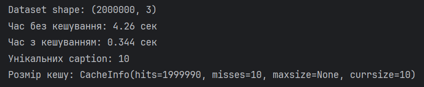

# Практична робота №2

## Кешування `.apply()` при роботі з великими наборами даних

### Мета роботи

Дослідити проблему продуктивності методу `.apply()` при роботі з великими DataFrame та реалізувати кешування результатів функції за допомогою `functools.lru_cache`.

---

### Теоретичні відомості

При роботі з великими наборами даних (мільйони записів) метод `.apply()` може суттєво знижувати продуктивність, оскільки:

* викликає Python-функцію для кожного рядка;
* не використовує векторизацію;
* повторно виконує однакові обчислення для повторюваних значень.

У великих web-scale датасетах, таких як LAION-5B, часто зустрічаються повторювані текстові описи (captions).

Якщо застосовується складна текстова трансформація (NLP-обробка, нормалізація, токенізація тощо), повторне виконання однакових обчислень призводить до зайвих витрат CPU-ресурсів.

Для оптимізації використовується `functools.lru_cache`, який:

* кешує результати функції,
* повертає збережене значення при повторному виклику,
* зменшує кількість реальних обчислень.

---

### Опис експерименту

Було змодельовано LAION-подібний датасет зі структурою:

* image_url
* caption
* similarity_score

Розмір: 2 000 000 записів.

Кількість унікальних caption: 10.

Було реалізовано дві версії обробки:

1. Без кешування
2. З використанням `lru_cache`

Обробка включала:

* приведення до нижнього регістру
* очищення регулярним виразом
* видалення дублікатів слів
* сортування
* об’єднання у рядок

---

### Результати

Після виконання програми було отримано:

* значне зменшення часу виконання при використанні кешування;
* фактична кількість реальних обчислень дорівнює кількості унікальних caption (10), а не 2 000 000.

`cache_info()` підтверджує, що більшість викликів було обслуговано з кешу.

---

### Аналіз

Без кешування:

Функція виконується N разів (2 000 000).

З кешуванням:

Функція виконується лише для унікальних значень (10),
інші 1 999 990 викликів повертаються з кешу.

Це демонструє суттєву оптимізацію CPU-навантаження.

---

### Обмеження підходу

* Аргументи функції повинні бути hashable.
* Функція має бути чистою (без побічних ефектів).
* При великій кількості унікальних значень кеш може займати значний обсяг пам’яті.
* Кешування не замінює векторизацію — це додатковий рівень оптимізації.

---

## Висновок

Кешування результатів функції всередині `.apply()` є ефективним методом оптимізації при роботі з великими наборами даних із повторюваними значеннями.

Для web-scale датасетів типу LAION-5B це дозволяє: зменшити кількість повторних обчислень, скоротити час виконання, оптимізувати використання ресурсів.

Метод особливо ефективний при невеликій кількості унікальних значень у великому масиві даних.
