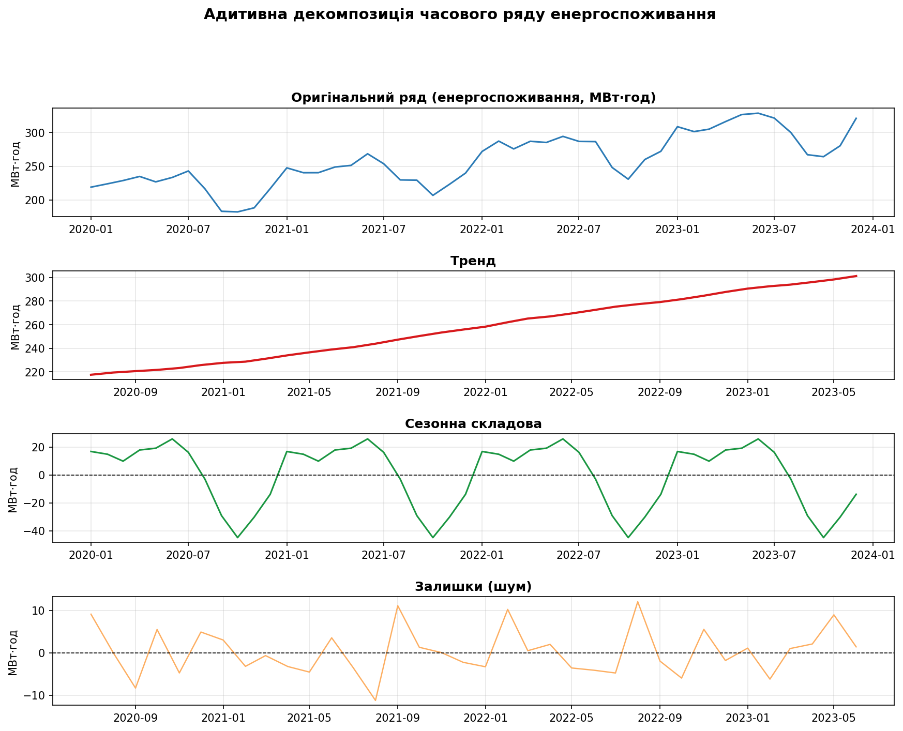
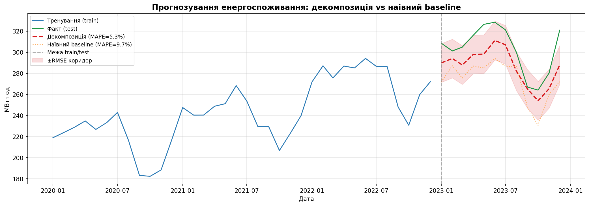
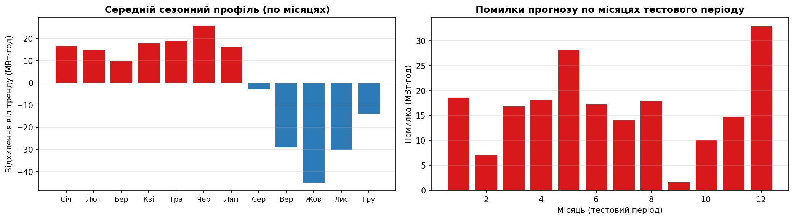
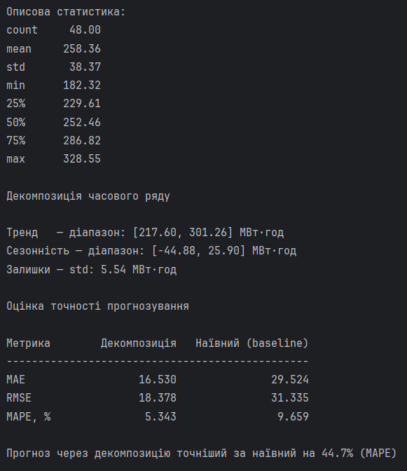

# Практична робота №3 

## Варіант 15: Виділення тренду, сезонності та залишків. Оцінка точності прогнозування.

## Мета роботи

Реалізувати розбиття часових даних про споживання енергії на трендову, сезонну та залишкову складові за допомогою `seasonal_decompose`. Побудувати прогноз на основі виділених компонентів та оцінити його точність у порівнянні з базовим (наївним) методом.

---

## Теоретичні відомості

### Адитивна модель декомпозиції

Часовий ряд розкладається на три незалежних складових:

$$Y_t = T_t + S_t + R_t$$

де:
- $Y_t$ — спостережуване значення в момент $t$
- $T_t$ — **тренд** (довгострокова тенденція зміни)
- $S_t$ — **сезонність** (регулярні повторювані коливання з фіксованим періодом)
- $R_t$ — **залишки** (випадковий шум після вилучення тренду і сезонності)

Адитивна модель підходить, коли амплітуда сезонних коливань **не залежить** від рівня тренду. Якщо амплітуда пропорційна тренду — застосовують мультиплікативну модель: $Y_t = T_t \cdot S_t \cdot R_t$.

### Метрики точності прогнозу

| Метрика | Формула | Інтерпретація |
|---------|---------|---------------|
| **MAE** | $\frac{1}{n}\sum\|y_i - \hat{y}_i\|$ | Середня абсолютна помилка в одиницях ряду |
| **RMSE** | $\sqrt{\frac{1}{n}\sum(y_i - \hat{y}_i)^2}$ | Штрафує великі помилки сильніше за MAE |
| **MAPE** | $\frac{1}{n}\sum\left\|\frac{y_i - \hat{y}_i}{y_i}\right\| \cdot 100\%$ | Відносна помилка у відсотках, незалежна від масштабу |

---

## Опис датасету

Для аналізу згенеровано **синтетичний місячний часовий ряд** із 48 точок (4 роки), що імітує щомісячне споживання електроенергії.

| Параметр | Значення |
|----------|----------|
| Кількість спостережень | 48 місяців (2020–2023) |
| Одиниця вимірювання | МВт·год |
| Середнє | ~258 МВт·год |
| Стандартне відхилення | ~38 МВт·год |
| Мінімум / Максимум | 182 / 329 МВт·год |

Ряд побудований як сума трьох складових: лінійного тренду зростання від 200 до 320 МВт·год, річного сезонного циклу з піками взимку та влітку, і нормального шуму зі стандартним відхиленням 8 МВт·год.

---

## Пояснення коду

### Генерація синтетичного ряду

```python
np.random.seed(42)
n_months = 48
dates = pd.date_range(start="2020-01-01", periods=n_months, freq="MS")

trend_component    = np.linspace(200, 320, n_months)
seasonal_component = (
    30 * np.sin(2 * np.pi * np.arange(n_months) / 12)
    + 15 * np.cos(4 * np.pi * np.arange(n_months) / 12)
)
noise  = np.random.normal(0, 8, n_months)
energy = trend_component + seasonal_component + noise

ts = pd.Series(energy, index=dates, name="energy_MWh")
```

`pd.date_range` з параметром `freq="MS"` (Month Start) генерує послідовність дат на перший день кожного місяця — це стандартний формат для місячних часових рядів. `np.linspace(200, 320, n_months)` рівномірно розподіляє значення від 200 до 320, моделюючи повільне зростання базового споживання. Сезонна складова будується через суперпозицію двох гармонік: перша з `sin` та `2π/12` задає річний цикл (один повний оберт за 12 місяців), друга з `cos` та `4π/12` — піврічний цикл, що додає характерний зимовий пік. Результат загортається у `pd.Series` з індексом-датами — це дає можливість далі використовувати всі можливості pandas для роботи з часовими рядами.

---

### Декомпозиція seasonal_decompose

```python
decomposition = seasonal_decompose(ts, model="additive", period=12)

trend    = decomposition.trend.dropna()
seasonal = decomposition.seasonal
residual = decomposition.resid.dropna()
```

`seasonal_decompose` реалізує класичний метод декомпозиції через ковзне середнє. Параметр `model="additive"` задає адитивну схему: $Y = T + S + R$. Параметр `period=12` вказує, що сезонний цикл становить 12 спостережень (один рік для місячних даних) — без нього функція не може визначити тривалість сезону. Внутрішньо алгоритм спочатку виділяє тренд як ковзне середнє з вікном `period`, потім сезонність обчислюється як середнє по кожній позиції циклу після видалення тренду, і нарешті залишки — це різниця між оригінальним рядом та сумою тренду і сезонності. Виклик `.dropna()` необхідний, оскільки ковзне середнє не може бути обчислене для перших і останніх `period/2` точок — вони отримують значення `NaN`.

---

### Розбиття train / test та прогнозування

```python
split_idx = 36
train = ts.iloc[:split_idx]
test  = ts.iloc[split_idx:]

decomp_train = seasonal_decompose(train, model="additive", period=12)

# Екстраполяція тренду
trend_train = decomp_train.trend.dropna()
x = np.arange(len(trend_train))
trend_coef = np.polyfit(x, trend_train.values, deg=1)
trend_line = np.poly1d(trend_coef)

future_x = np.arange(len(trend_train), len(trend_train) + len(test))
trend_forecast = trend_line(future_x)

# Перенесення сезонного патерну
season_pattern    = decomp_train.seasonal.values[-12:]
seasonal_forecast = np.tile(season_pattern, int(np.ceil(len(test) / 12)))[:len(test)]

forecast = trend_forecast + seasonal_forecast
```

Дані розбиваються у пропорції 75/25 (36 місяців тренування, 12 тестових). Декомпозиція виконується **тільки на тренувальних даних** — це критично важливо для коректної оцінки, оскільки тестові дані не повинні брати участі у навчанні. Тренд екстраполюється лінійно через `np.polyfit` з `deg=1` — функція підбирає коефіцієнти прямої $ax + b$ методом найменших квадратів. `np.poly1d` перетворює масив коефіцієнтів у викликний об'єкт-поліном. Сезонний патерн переноситься простим повторенням останнього повного циклу через `np.tile`, що виправдано за умови стаціонарної сезонності. Фінальний прогноз — сума цих двох компонентів.

---

### Наївний baseline

```python
naive_forecast = pd.Series(
    train.values[-12:],
    index=test.index
)
```

Наївний прогноз (seasonal naive) — найпростіший можливий підхід: для кожного місяця тестового року передбачається те ж значення, що і рік тому. Це стандартний baseline для сезонних рядів: якщо побудований метод не перевершує наївний, він не несе практичної цінності.

---

### Обчислення метрик

```python
mae_decomp  = mean_absolute_error(test, forecast_series)
rmse_decomp = rmse(test, forecast_series)
mape_decomp = mape(test.values, forecast_series.values)
```

`mean_absolute_error` та `mean_squared_error` імпортуються з `sklearn.metrics`. RMSE обчислюється вручну як `sqrt(MSE)`, оскільки `sklearn` повертає MSE. Власна функція `mape` обчислює середнє абсолютне відсоткове відхилення — ця метрика зручна для порівняння точності між різними рядами, бо виражена у відсотках і не залежить від масштабу вимірювань.

---

### Візуалізація декомпозиції

```python
fig = plt.figure(figsize=(14, 10))
gs  = gridspec.GridSpec(4, 1, hspace=0.5)

ax0 = fig.add_subplot(gs[0])  # оригінал
ax1 = fig.add_subplot(gs[1])  # тренд
ax2 = fig.add_subplot(gs[2])  # сезонність
ax3 = fig.add_subplot(gs[3])  # залишки
```

`gridspec.GridSpec` дає більше контролю над розміщенням підграфіків порівняно зі стандартним `plt.subplots`: параметр `hspace=0.5` задає вертикальний відступ між панелями. Кожна з чотирьох панелей відображає одну складову декомпозиції. Для сезонності та залишків додається горизонтальна лінія `axhline(0)`, щоб легше читати знак відхилень.

---

### Графік прогнозу

```python
ax.fill_between(test.index,
                forecast_series - rmse_decomp,
                forecast_series + rmse_decomp,
                alpha=0.15, color="#D7191C", label="±RMSE коридор")
```

`fill_between` малює напівпрозорий коридор невизначеності навколо прогнозу шириною ±RMSE. Це стандартна практика візуалізації прогнозів — дозволяє одразу оцінити довірчий діапазон разом із точковим прогнозом.

---

### Сезонний профіль

```python
seasonal_profile = decomposition.seasonal.groupby(
    decomposition.seasonal.index.month
).mean()
```

`.groupby(index.month)` групує всі значення сезонної складової за номером місяця та усереднює їх по всіх роках. Результат — "чистий" сезонний профіль: наскільки кожен місяць відхиляється від тренду в середньому. Позитивні значення (червоні стовпці) — місяці вище тренду, від'ємні (сині) — нижче.

---

## Результати 
### Декомпозиція часового ряду

Чотири панелі зверху вниз: оригінальний ряд, тренд, сезонна складова, залишки.



### Прогноз vs факт

Синя лінія — тренувальні дані, зелена — фактичні значення тестового року, червона пунктирна — прогноз через декомпозицію, помаранчева пунктирна — наівний baseline. Червоний коридор — ±RMSE.



### Сезонний профіль та помилки прогнозу

Ліва панель — середній сезонний профіль по місяцях. Права — помилки прогнозу в кожному місяці тестового року.



### Результат виконання скрипту


---

## Оцінка точності прогнозування

| Метрика | Декомпозиція | Наївний baseline |
|---------|-------------|-----------------|
| **MAE** | 16.5 МВт·год | 29.5 МВт·год |
| **RMSE** | 18.4 МВт·год | 31.3 МВт·год |
| **MAPE** | 5.3 % | 9.7 % |

Прогноз на основі декомпозиції перевершує наівний baseline на **~45% за MAPE**.

---

## Висновки

Метод `seasonal_decompose` з адитивною моделлю успішно розклав часовий ряд енергоспоживання на три інтерпретовані складові: лінійний тренд зростання, річний сезонний цикл з амплітудою до 45 МВт·год та малий залишковий шум (std ≈ 5.5 МВт·год). Невелика дисперсія залишків підтверджує, що адитивна модель добре відповідає структурі даних.

Прогноз, побудований через екстраполяцію тренду та перенесення сезонного патерну, досяг MAPE = 5.3% — що вдвічі краще за наівний сезонний baseline (9.7%). Це демонструє, що явне виділення тренду і врахування його динаміки суттєво підвищує якість прогнозу порівняно з простим повторенням минулорічних значень. Основне джерело помилки — нелінійні відхилення тренду та шум, які лінійна екстраполяція не здатна вловити.
