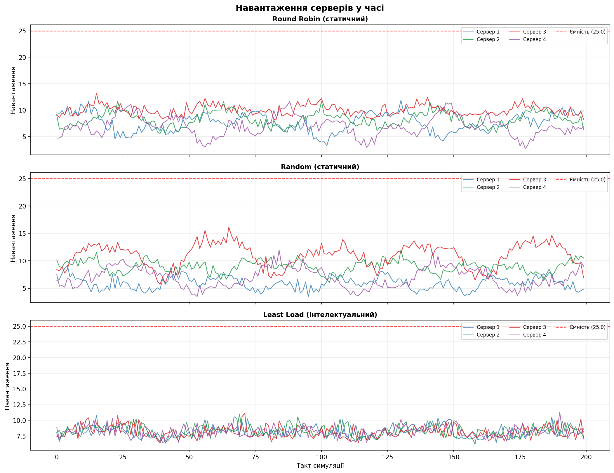
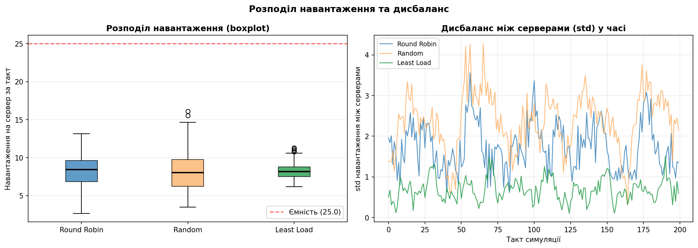
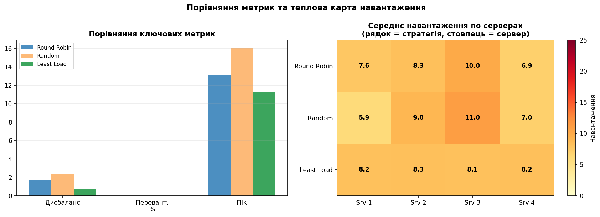
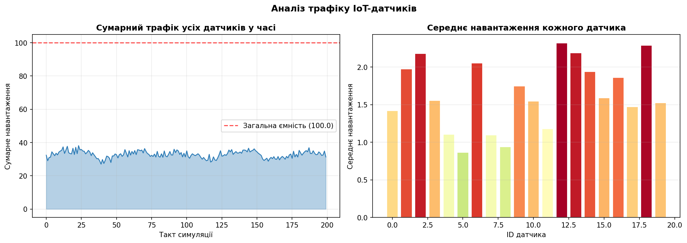
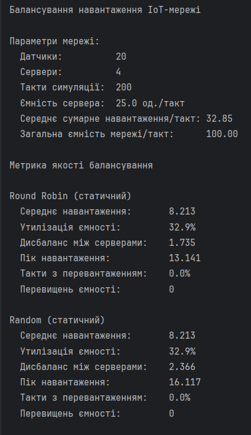
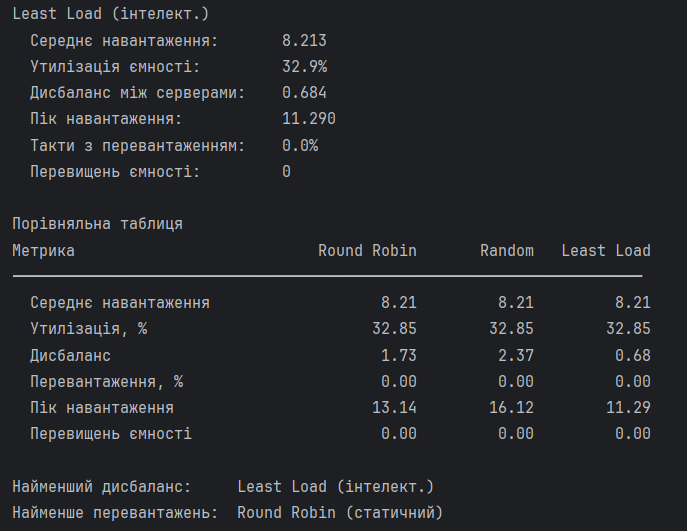

# Практична робота №4

## Варіант 15: Оптимізація навантаження на IoT-мережі. Інтелектуальне балансування навантаження для розподілених IoT-датчиків

## Мета роботи

Реалізувати алгоритм інтелектуального балансування навантаження для мережі розподілених IoT-датчиків, що збирають дані про споживання енергії. Порівняти його зі статичними стратегіями Round Robin та Random за метриками дисбалансу, пікового навантаження та кількості перевищень ємності серверів.

---

## Теоретична база

### Проблема балансування навантаження в IoT

У системах збору даних про енергоспоживання IoT-датчики безперервно генерують потоки даних нерівномірної інтенсивності — залежно від часу доби, пори року та умов довкілля. Якщо не керувати розподілом цих потоків між серверами-обробниками, одні сервери можуть бути перевантажені, тоді як інші простоюють.

**Балансувальник навантаження** — це компонент, який вирішує, на який сервер надіслати кожний вхідний пакет даних.

### Три стратегії балансування

**Round Robin (статичний)** — найпростіший підхід. Датчики рівномірно розподіляються між серверами раз і назавжди: датчик 0 → сервер 0, датчик 1 → сервер 1, ..., датчик 4 → сервер 0 і так далі. Перевага — простота реалізації. Недолік — не враховує, що різні датчики генерують різний обсяг трафіку.

**Random (статичний)** — кожен датчик отримує випадковий сервер при "підключенні". Розподіл також фіксований. Теоретично при великій кількості датчиків розподіл має вирівнятись, але на практиці виникає суттєвий дисбаланс.

**Least Load (інтелектуальний)** — на кожному такті кожен пакет надсилається на сервер із **найменшим поточним навантаженням**. Рішення приймається динамічно в реальному часі на основі актуального стану мережі. Це потребує більше обчислювальних ресурсів, але забезпечує значно кращий баланс.

### Ключові метрики оцінки

| Метрика | Що вимірює |
|---------|-----------|
| **Середнє навантаження** | Середнє використання серверів за всі такти |
| **Утилізація ємності, %** | Наскільки ефективно використовується наявна ємність |
| **Дисбаланс (std)** | Стандартне відхилення навантаження між серверами — чим менше, тим рівномірніше |
| **Пік навантаження** | Максимальне навантаження на будь-який сервер за весь час |
| **Перевантаження, %** | Відсоток тактів, де хоча б один сервер перевищив ємність |

---

## Опис симуляції

| Параметр | Значення |
|----------|----------|
| Кількість IoT-датчиків | 20 |
| Кількість серверів | 4 |
| Тривалість симуляції | 200 тактів |
| Ємність одного сервера | 25 од./такт |
| Загальна ємність мережі | 100 од./такт |
| Середнє сумарне навантаження | ~32.85 од./такт |

Кожен датчик має унікальний патерн генерації трафіку: власну базову інтенсивність, фазу та тривалість циклу. Це імітує реальну ситуацію, де різні датчики (наприклад, промислові лічильники, побутові датчики, вуличне освітлення) мають принципово різні режими роботи.

---

## Пояснення коду

### Генерація трафіку датчиків

```python
for i in range(N_SENSORS):
    base   = np.random.uniform(0.5, 2.0)
    phase  = np.random.uniform(0, 2 * np.pi)
    period = np.random.choice([20, 40, 60])
    t      = np.arange(N_TICKS)
    load   = base + 1.0 * np.sin(2 * np.pi * t / period + phase) \
             + np.random.exponential(0.3, N_TICKS)
    load   = np.clip(load, 0.1, 5.0)
    sensor_loads.append(load)
```

Для кожного з 20 датчиків генерується індивідуальний часовий ряд навантаження. `base` — базова інтенсивність: деякі датчики "активніші" за інших. `phase` — випадковий зсув фази синусоїди, щоб датчики не були синхронізовані між собою. `period` — тривалість циклу (20, 40 або 60 тактів), що імітує різні режими роботи датчиків. `np.random.exponential` додає асиметричний шум: більшість сплесків невеликі, але іноді трапляються великі пакети. `.clip(0.1, 5.0)` не дає навантаженню вийти за реалістичний діапазон. Результат — масив `sensor_loads` форми `(20, 200)`: рядки = датчики, стовпці = такти.

---

### Стратегія 1 — Round Robin

```python
def static_round_robin(sensor_loads, n_servers):
    n_sensors, n_ticks = sensor_loads.shape
    server_loads = np.zeros((n_servers, n_ticks))
    for sid in range(n_sensors):
        server_loads[sid % n_servers] += sensor_loads[sid]
    dropped = (server_loads > MAX_LOAD).sum()
    return server_loads, int(dropped)
```

Оператор `%` — це залишок від ділення. `sid % n_servers` для 4 серверів дає послідовність: 0, 1, 2, 3, 0, 1, 2, 3, … Тобто датчик 0 → сервер 0, датчик 4 → сервер 0, датчик 8 → сервер 0 і так далі. Весь трафік датчика додається до відповідного рядка матриці `server_loads` одразу для всіх тактів, бо розподіл статичний — він не змінюється з часом. `(server_loads > MAX_LOAD).sum()` рахує кількість елементів матриці, що перевищують ємність.

---

### Стратегія 2 — Random

```python
def static_random(sensor_loads, n_servers):
    n_sensors, n_ticks = sensor_loads.shape
    server_loads = np.zeros((n_servers, n_ticks))
    assignments = np.random.randint(0, n_servers, size=n_sensors)
    for sid in range(n_sensors):
        server_loads[assignments[sid]] += sensor_loads[sid]
    dropped = (server_loads > MAX_LOAD).sum()
    return server_loads, int(dropped)
```

`np.random.randint(0, n_servers, size=n_sensors)` генерує масив із 20 випадкових чисел від 0 до 3 — це "призначення" кожного датчика. Потім логіка така сама, як у Round Robin: трафік кожного датчика додається до свого сервера. Різниця в тому, що розподіл не рівномірний — деякі сервери можуть отримати 7 датчиків, інші 3. Саме тому дисбаланс у Random вищий.

---

### Стратегія 3 — Least Load (інтелектуальна)

```python
def intelligent_least_load(sensor_loads, n_servers, max_load):
    n_sensors, n_ticks = sensor_loads.shape
    server_loads = np.zeros((n_servers, n_ticks))
    dropped = 0

    for t in range(n_ticks):
        current = np.zeros(n_servers)

        for sid in range(n_sensors):
            packet = sensor_loads[sid, t]
            target = int(np.argmin(current))

            if current[target] + packet <= max_load:
                current[target] += packet
            else:
                current[target] += packet
                dropped += 1

        server_loads[:, t] = current

    return server_loads, dropped
```

Це принципово інша архітектура: є зовнішній цикл по тактах і внутрішній — по датчиках. У кожному такті `current` — це масив із 4 елементів, що відображає накопичене навантаження серверів **у цьому конкретному такті**. Для кожного пакета `np.argmin(current)` знаходить індекс сервера з найменшим поточним навантаженням — це і є ключова інтелектуальна операція. Пакет додається саме туди. Завдяки цьому жоден сервер не перевантажується доти, доки інші мають вільну ємність. В кінці такту поточний стан всіх серверів зберігається у відповідний стовпець матриці `server_loads`.

---

### Функція обчислення метрик

```python
def compute_metrics(server_loads, max_load, name, dropped):
    mean_load    = server_loads.mean()
    imbalance    = server_loads.std(axis=0).mean()
    overload_pct = (server_loads.max(axis=0) > max_load).mean() * 100
    utilization  = mean_load / max_load * 100
    ...
```

`server_loads.mean()` — середнє по всій матриці. `server_loads.std(axis=0)` — стандартне відхилення між серверами **для кожного такту** (axis=0 означає "по рядках"), потім `.mean()` усереднює по часу — отримуємо середній дисбаланс. `server_loads.max(axis=0)` — максимальне навантаження серед усіх серверів у кожен такт, потім порівнюємо з порогом і рахуємо відсоток таких тактів.

---

### Теплова карта

```python
hm = np.array([
    rr_loads.mean(axis=1),
    rand_loads.mean(axis=1),
    smart_loads.mean(axis=1),
])
im = axes3[1].imshow(hm, aspect="auto", cmap="YlOrRd", vmin=0, vmax=MAX_LOAD)
```

`.mean(axis=1)` усереднює по тактах (axis=1 = по стовпцях), залишаючи одне число для кожного сервера. Результат — матриця 3×4: три стратегії × чотири сервери. `imshow` відображає її як теплову карту: жовтий = мале навантаження, червоний = велике. Це дозволяє одним поглядом побачити, наскільки рівномірно кожна стратегія розподілила навантаження між серверами.

---

## Результати
### Навантаження серверів у часі

Ліворуч — `load_over_time.png`. Три панелі відповідають трьом стратегіям. У Round Robin лінії серверів розходяться помірно — деякі датчики активніші, і їхній сервер постійно завантажений більше. У Random розкид ще більший, бо випадковий розподіл не гарантує рівності. У Least Load чотири лінії йдуть дуже близько одна до одної — балансувальник постійно вирівнює навантаження в реальному часі.



### Boxplot та дисбаланс у часі

Boxplot показує розкид значень навантаження: у Least Load "коробка" значно вужча — менше варіативності. На правій панелі дисбаланс (std між серверами) у кожен такт: синя і жовта лінії (статичні стратегії) мають постійний ненульовий дисбаланс, зелена (Least Load) тримається значно нижче протягом усієї симуляції.



### Порівняння метрик та теплова карта

На тепловій карті видно: у Round Robin і Random кольори клітинок серверів різні (нерівномірно), у Least Load — майже однакові, що підтверджує рівномірний розподіл.



### Трафік датчиків

Сумарний трафік коливається навколо ~32 одиниць — значно нижче загальної ємності мережі (100). Це означає, що мережа не перевантажена в цілому, але без розумного балансування окремі сервери можуть отримувати непропорційно більше трафіку.



### Результат виконання скрипту




Середнє навантаження однакове у всіх стратегій — це закономірно, адже загальний обсяг трафіку від датчиків не залежить від способу розподілу. Різниця проявляється в рівномірності цього розподілу.

---

## Висновки

Усі три стратегії забезпечили однакове середнє навантаження (~8.21 од.) і не допустили перевищення ємності серверів — мережа в цілому має достатній запас потужності. Різниця проявляється в рівномірності розподілу: дисбаланс Least Load (0.684) удвічі нижчий за Round Robin (1.735) і втричі нижчий за Random (2.366), а пік навантаження — найменший серед усіх стратегій (11.29 проти 13.14 і 16.12).

Це ілюструє фундаментальну перевагу динамічного балансування: статичні стратегії призначають датчики серверам раз і назавжди, не враховуючи мінливість трафіку в часі. Інтелектуальний алгоритм щотакту знає реальний стан мережі і направляє кожен пакет туди, де є найбільше вільної ємності. У реальних IoT-системах, де навантаження може різко змінюватись, ця перевага стає критичною — вона зменшує ризик перегріву окремих вузлів, знижує затримки і підвищує відмовостійкість всієї мережі.
