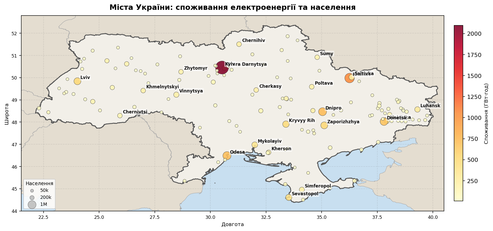
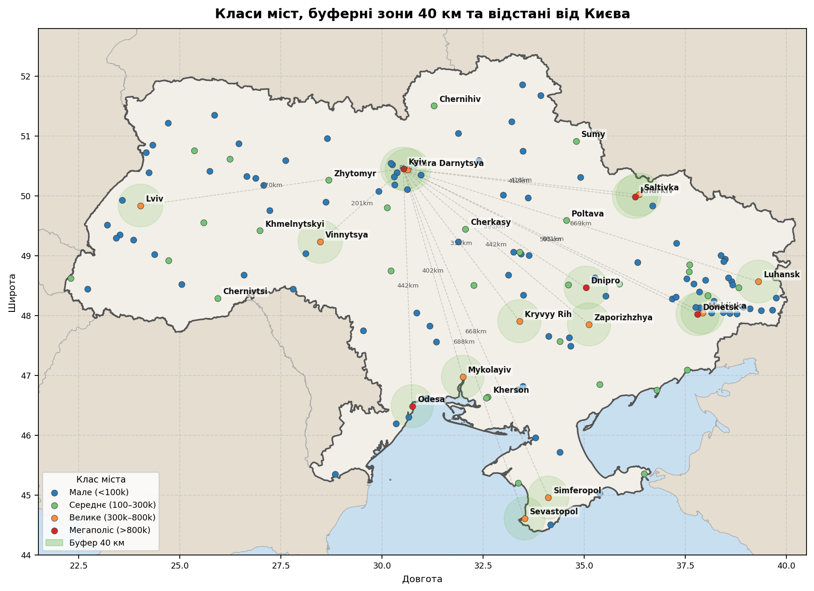
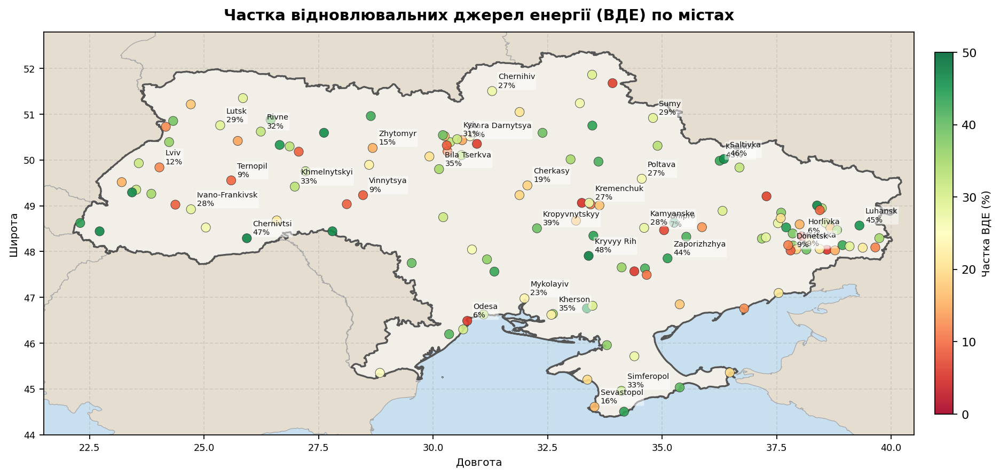
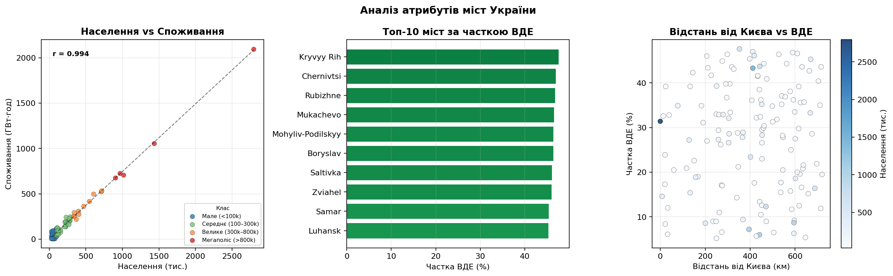
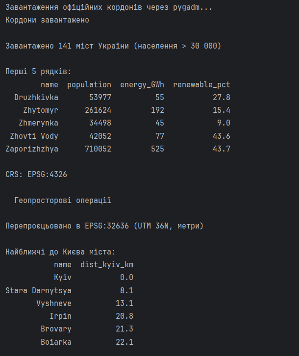
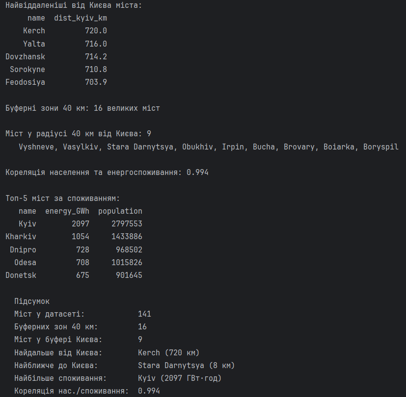

# Практична робота №5

## Обробка та візуалізація геопросторових даних. Бібліотека GeoPandas — аналіз міст України

## Мета роботи

Використовуючи бібліотеку `geopandas`, завантажити реальні дані про міста України, створити `GeoDataFrame`, виконати геопросторові операції (перепроєцювання, буферні зони, обчислення відстаней, просторові запити) та візуалізувати результати у вигляді тематичних карт на основі реального контуру країни.

---

## Теоретичні відомості

### Геопросторові дані та GeoDataFrame

`geopandas` розширює `pandas` підтримкою геометричних об'єктів бібліотеки `shapely`. `GeoDataFrame` — це звичайний `DataFrame` з додатковим стовпцем `geometry`:

| Тип геометрії | Клас shapely | Приклад |
|---------------|-------------|---------|
| Точка | `Point(lon, lat)` | Місто, датчик |
| Лінія | `LineString(...)` | Дорога, річка |
| Полігон | `Polygon(...)` | Кордон країни, область |

### Системи координат (CRS)

- **EPSG:4326 (WGS84)** — глобальна система в градусах (широта/довгота). Стандарт для GPS і веб-карт. Не підходить для вимірювань у метрах.
- **EPSG:32636 (UTM Zone 36N)** — проєкційна система в метрах, оптимальна для України. Дозволяє точно вимірювати відстані та площі.

### Буферні зони

Буфер — полігон, побудований на відстані `d` навколо геометрії. `Point.buffer(40000)` у метричній CRS створює коло радіусом 40 км. Застосовується для аналізу зони охоплення або впливу.

---

## Опис даних

### Джерела даних

**Карта країн** — пакет `pygadm`, який надає доступ до офіційної бази адміністративних кордонів GADM (Global Administrative Areas) версії 4.1. Кордони завантажуються автоматично при першому запуску. У базі GADM Крим та Севастополь фігурують як регіони України (`UKR.4_1` та `UKR.20_1`), тому карта відображається коректно без жодних ручних виправлень.

**Міста** — пакет `geonamescache` із вбудованою базою даних GeoNames. Містить реальні географічні координати та чисельність населення для міст без потреби звертатись до API.

### Атрибути датасету

| Атрибут | Тип | Джерело | Опис |
|---------|-----|---------|------|
| `name` | str | geonamescache | Назва міста |
| `lat`, `lon` | float | geonamescache | Реальні координати (WGS84) |
| `population` | int | geonamescache | Реальна чисельність населення |
| `energy_GWh` | int | синтетичний | Річне споживання енергії (ГВт·год) |
| `renewable_pct` | float | синтетичний | Частка відновлювальних джерел (%) |
| `size_class` | str | обчислений | Клас міста за розміром |
| `geometry` | Point | обчислений | Геометрія (shapely) |

Відібрано **141 місто** з населенням понад 30 000 осіб.

---

## Пояснення коду

### Завантаження карти країн через pygadm

```python
import pygadm

ukraine = pygadm.get_items(name='Ukraine', content_level=0)

neighbors_list = ['Poland', 'Slovakia', 'Hungary', 'Romania', 'Moldova', 'Belarus', 'Russia']
neighbors = pygadm.get_items(name=neighbors_list, content_level=0)
```

`pygadm` — це обгортка над базою GADM (Global Administrative Areas), яка містить офіційні адміністративні кордони всіх країн світу. `get_items(name='Ukraine', content_level=0)` завантажує кордон України на рівні країни (`content_level=0` означає найвищий адміністративний рівень — сама країна, без поділу на регіони). Функція повертає готовий `GeoDataFrame` із геометрією та метаданими. Те саме викликається для списку сусідніх країн — `pygadm` приймає одразу список назв і повертає їх усі одним `GeoDataFrame`. Перевага GADM перед Natural Earth полягає в тому, що в цій базі Крим і Севастополь зареєстровані як регіони України (`UKR.4_1` і `UKR.20_1`), тому карта відображається коректно без будь-яких ручних виправлень полігонів.

---

### Завантаження реальних даних міст

```python
gc = geonamescache.GeonamesCache()
ua_raw = [
    v for v in gc.get_cities().values()
    if v["countrycode"] == "UA" and v["population"] > 30_000
]
df = pd.DataFrame(ua_raw)[["name", "latitude", "longitude", "population"]]
```

`GeonamesCache()` завантажує вбудовану базу даних міст без мережевих запитів. `get_cities()` повертає словник усіх міст світу. List comprehension фільтрує тільки українські міста з населенням понад 30 тисяч. `pd.DataFrame(ua_raw)` перетворює список словників у таблицю — pandas автоматично визначає стовпці з ключів.

---

### Створення GeoDataFrame

```python
geometry = [Point(lon, lat) for lon, lat in zip(df["lon"], df["lat"])]
gdf = gpd.GeoDataFrame(df, geometry=geometry, crs="EPSG:4326")
```

`Point(lon, lat)` — спочатку **довгота** (lon, вісь X), потім **широта** (lat, вісь Y). `zip(df["lon"], df["lat"])` попарно об'єднує два стовпці. `gpd.GeoDataFrame` приймає звичайний DataFrame і додає геометрію через параметр `geometry=`. `crs="EPSG:4326"` задає систему координат — без неї geopandas не може виконувати просторові операції коректно.

---

### Перепроєцювання CRS

```python
gdf_utm = gdf.to_crs("EPSG:32636")
```

`to_crs` перераховує координати всіх геометрій з градусів (WGS84) у метри (UTM 36N). Без цього кроку `buffer(40000)` дав би коло радіусом 40 000 градусів замість кілометрів.

---

### Буферні зони

```python
large = gdf_utm[gdf_utm["population"] > 300_000].copy()
large["buffer_geom"] = large.geometry.buffer(40_000)
```

Фільтруємо міста з населенням > 300 тис. `.copy()` — важливо: без нього pandas видасть попередження про зміну зрізу. `.buffer(40_000)` викликається на стовпці геометрій і для кожної точки будує коло радіусом 40 км у метричних одиницях. Результат зберігається як новий стовпець поруч із оригінальними точками.

---

### Просторовий запит Within

```python
kyiv_buf = large[large["name"] == "Kyiv"]["buffer_geom"].values[0]
in_buf   = gdf_utm[gdf_utm.geometry.within(kyiv_buf) & (gdf_utm["name"] != "Kyiv")]
```

`.within(polygon)` — геопросторовий предикат: повертає `True` для кожного об'єкта, чия геометрія повністю знаходиться всередині заданого полігону. Аналог SQL `ST_Within`. Результат: 9 міст у радіусі 40 км від Києва.

---

### Обчислення відстаней

```python
kyiv_geom = gdf_utm[gdf_utm["name"] == "Kyiv"].geometry.values[0]
gdf_utm["dist_kyiv_km"] = (gdf_utm.geometry.distance(kyiv_geom) / 1000).round(1)
```

`.distance(point)` для кожного об'єкта рахує відстань до точки Київ у метрах. Ділення на 1000 дає кілометри. Операція повністю векторизована.

---

### Відображення буферних зон на карті

```python
buf_wgs = large.set_geometry("buffer_geom").to_crs("EPSG:4326")
buf_wgs.plot(ax=ax2, color="#4dac26", alpha=0.13, edgecolor="#4dac26", zorder=3)
```

`set_geometry("buffer_geom")` перемикає активну геометрію з точок на полігони-буфери. `.to_crs("EPSG:4326")` повертає координати в градуси для узгодженості з рештою карти. `alpha=0.13` — майже прозоре заливання.

---

## Результати
### Споживання енергії та населення

Розмір точки кодує населення міста, колір — рівень споживання електроенергії (жовтий → помаранчевий → темно-червоний). Видно, що Київ різко виділяється і за розміром і за споживанням, на сході концентруються промислові міста (Харків, Дніпро, Донецьк, Запоріжжя).



### Класи міст, буферні зони, відстані від Києва

Колір точки відображає клас міста за населенням. Зелені напівпрозорі кола — буферні зони 40 км навколо 16 великих міст. Пунктирні лінії з підписами — відстані від Києва до кожного великого міста.



### Частка відновлювальних джерел енергії

Колір точки по шкалі "червоний → жовтий → зелений": зелений — висока частка ВДЕ, червоний — низька. Біля кожного великого міста підписані назва і відсоток.



### Аналітичні графіки

Три панелі: scatter "населення vs споживання" з лінією тренду і коефіцієнтом кореляції; горизонтальний bar chart топ-10 міст за часткою ВДЕ; scatter "відстань від Києва vs частка ВДЕ" з кольором за населенням.



### Результат виконання скрипту




---

## Висновки

Засобами `geopandas` реалізовано повний цикл обробки геопросторових даних: завантаження офіційних кордонів країн через `pygadm` (база GADM 4.1, де Крим коректно відображається у складі України), завантаження 141 реального міста з `geonamescache`, перепроєцювання між WGS84 та UTM, побудова буферних зон і просторовий запит `.within()`.

Кореляція між населенням і споживанням енергії склала r = 0.994, що підтверджує майже лінійну залежність. Просторовий запит виявив 9 міст у радіусі 40 км від Києва — Ірпінь, Буча, Бровари, Бориспіль та інші. Найвіддаленіше місто — Керч (720 км).
