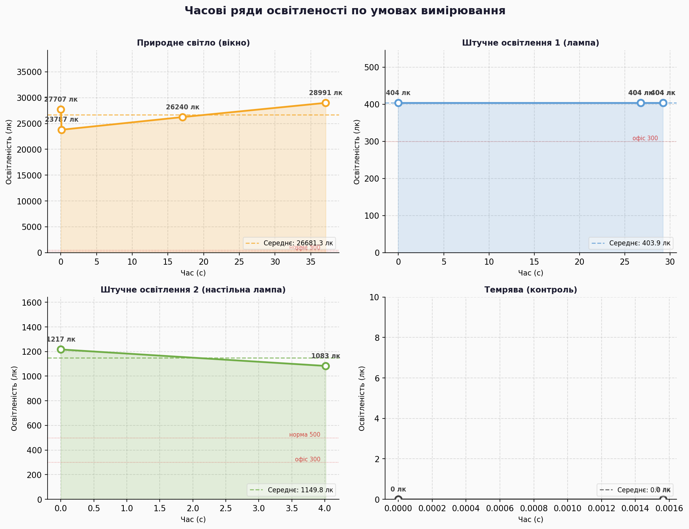
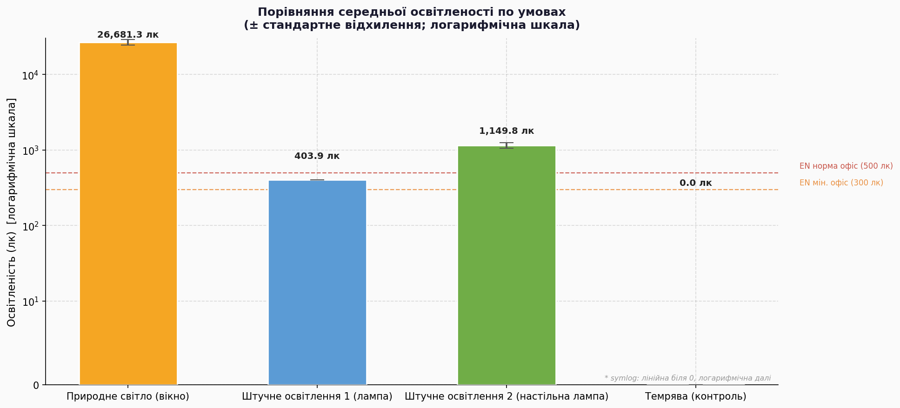
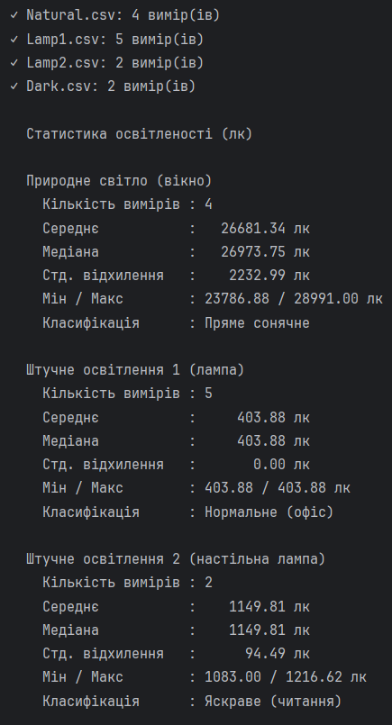
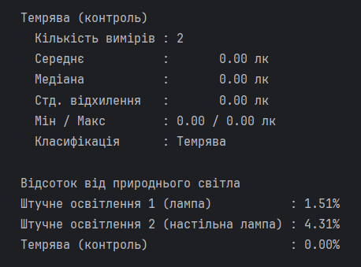

# Практична робота №6

## Обробка та аналіз даних сенсора освітленості смартфона. Phyphox — порівняння природного та штучного освітлення

## Мета роботи

Використовуючи мобільний додаток **Phyphox**, зібрати реальні дані з датчика освітленості смартфона в чотирьох різних умовах: природне денне освітлення, два типи штучного освітлення та темрява. Завантажити отримані CSV-файли, обробити та проаналізувати їх засобами Python (`pandas`, `matplotlib`, `numpy`), виконати статистичний аналіз, класифікацію за міжнародним стандартом EN 12464-1 та побудувати серію тематичних графіків.

---

## Теоретичні відомості

### Датчик освітленості смартфона

Більшість сучасних смартфонів оснащені фотосенсором для автоматичного регулювання яскравості екрана. Він вимірює **освітленість** — величину світлового потоку, що падає на одиницю площі поверхні. Одиниця вимірювання — **люкс (лк, lx)**. Один люкс дорівнює одному люмену на квадратний метр.

### Шкала освітленості та стандарт EN 12464-1

| Умова | Орієнтовне значення |
|-------|---------------------|
| Повна темрява | 0 лк |
| Слабке освітлення (коридор) | 50–200 лк |
| Офісна норма за EN 12464-1 | 300–500 лк |
| Яскраве штучне (читання) | 500–2 000 лк |
| Хмарний день на вулиці | 1 000–10 000 лк |
| Сонячний день біля вікна | 10 000–100 000 лк |
| Пряме сонце | > 100 000 лк |

Стандарт EN 12464-1 регламентує мінімальні рівні освітленості для різних типів приміщень. Для офісних робочих місць вимагається не менше **300–500 лк**.

---

## Опис даних

### Джерело даних

Дані зібрані за допомогою **Phyphox** (Physical Phone Experiments) — безкоштовного мобільного додатку для Android та iOS, розробленого RWTH Aachen University. Phyphox надає прямий доступ до внутрішніх датчиків смартфона та дозволяє експортувати результати у форматі CSV.

### Умови вимірювань

| Файл | Умова | Опис |
|------|-------|------|
| `Raw_Data1.csv` | Природне світло | Датчик направлений до вікна, денне освітлення |
| `Raw_Data2.csv` | Штучне освітлення 1 | Кімнатна лампа |
| `Raw_Data3.csv` | Штучне освітлення 2 | Настільна лампа |
| `Raw_Data4.csv` | Темрява | Датчик повністю перекритий — контрольний вимір |

### Атрибути датасету

| Атрибут | Тип | Джерело | Опис |
|---------|-----|---------|------|
| `time_s` | float | Phyphox CSV | Час від початку запису (секунди) |
| `illuminance_lx` | float | Phyphox CSV | Освітленість у люксах |
| `mean`, `std`, `min`, `max` | float | обчислений | Базова статистика по кожній умові |
| `class` | str | обчислений | Клас освітленості за EN 12464-1 |

Усього зібрано **10 вимірів** у чотирьох умовах (4 + 3 + 1 + 2). Невелика кількість відліків є нормальною для датчика освітленості — він не призначений для швидких вимірювань і оновлює значення рідше, ніж, наприклад, акселерометр.

> Значення у CSV записані у науковій нотації (`2.770700000E4` = 27 707 лк) — стандартний формат Phyphox, який `pandas` розпізнає автоматично.

---

## Пояснення коду

### Завантаження та нормалізація

```python
files = {
    "Природне світло (вікно)": "Natural.csv",
    "Штучне освітлення 1 (лампа)": "Lamp1.csv",
    "Штучне освітлення 2 (настільна лампа)": "Lamp2.csv",
    "Темрява (контроль)": "Dark.csv",
}

datasets = {}
for label, fname in files.items():
    df = pd.read_csv(fname)
    df.columns = ["time_s", "illuminance_lx"]
    datasets[label] = df
```

`pd.read_csv` автоматично розпізнає наукову нотацію чисел. Перейменування стовпців через `df.columns` робить код незалежним від мови заголовків у файлі (Phyphox генерує їх англійською). Усі датасети зберігаються у словнику `datasets` для зручного ітерування.

---

### Обчислення статистики та класифікація

```python
def classify_illuminance(lx):
    if lx < 1:        return "Темрява"
    elif lx < 200:    return "Слабке (коридор)"
    elif lx < 500:    return "Нормальне (офіс)"
    elif lx < 2000:   return "Яскраве (читання)"
    elif lx < 10000:  return "Дуже яскраве"
    else:             return "Пряме сонячне"

stats[label] = {
    "mean":   lx.mean(),
    "median": lx.median(),
    "std":    lx.std() if len(lx) > 1 else 0.0,
    "min":    lx.min(),
    "max":    lx.max(),
    "class":  classify_illuminance(lx.mean()),
}
```

Перевірка `len(lx) > 1` запобігає помилці при обчисленні стандартного відхилення для одного виміру (екран). Функція `classify_illuminance` порівнює середнє значення з порогами EN 12464-1.

---

### Рисунок 1 — Часові ряди

```python
fig1, axes = plt.subplots(2, 2, figsize=(14, 9))

for ax, (label, df) in zip(axes.flat, datasets.items()):
    ax.fill_between(t, lx, alpha=0.18, color=c)
    ax.plot(t, lx, "o-", ...)
    ax.axhline(mean_val, linestyle="--", ...)
```

Сітка 2×2 — по одній панелі на кожну умову. `fill_between` малює тіньову область під кривою для кращого сприйняття. На кожному графіку нанесені пунктирні лінії норм EN 12464-1 (300 і 500 лк), якщо вони потрапляють у видиму зону. Кожна точка підписана своїм значенням у люксах.

---

### Рисунок 2 — Порівняльна діаграма з логарифмічною шкалою

```python
ax2.bar(x, means, yerr=stds, ...)
ax2.set_yscale("symlog", linthresh=10)
```

`symlog` (симетричний логарифм) — особливий режим шкали: лінійний поблизу нуля (щоб коректно показати 0 лк темряви), логарифмічний далі. Це необхідно, бо значення варіюються від 0 до ~27 000 лк: на лінійній шкалі лампа і екран були б практично невидимі. Планки помилок (`yerr=stds`) відображають стандартне відхилення по кожній умові.

---

## Результати
### Часові ряди освітленості

Окремі панелі для кожної умови з підписами значень, середньою лінією та орієнтирами норм EN 12464-1.



### Порівняльна діаграма (логарифмічна шкала)

Стовпчаста діаграма з `symlog`-шкалою — єдиний спосіб одночасно показати значення від 0 до 27 000 лк без втрати інформації про малі джерела.



### Результат виконання скрипту



---

## Висновки

Засобами pandas та matplotlib реалізовано повний цикл обробки реальних сенсорних даних: завантаження CSV-файлів з Phyphox, нормалізація, обчислення статистики, класифікація за EN 12464-1 та триступенева візуалізація.

Природне денне освітлення через вікно (~26 681 лк) у 66 разів перевищує рівень стельової лампи (~404 лк) та у 23 рази — рівень настільної лампи (~1 150 лк). Це наочно пояснює, чому тривала робота під штучним освітленням втомлює очі більше, ніж при денному світлі — зорова система змушена компенсувати суттєву різницю в інтенсивності.

Стельова лампа (~404 лк) формально відповідає мінімальній нормі EN 12464-1 для офісних приміщень (300–500 лк) і потрапляє в клас «Нормальне (офіс)». Настільна лампа (~1 150 лк) перевищує офісну норму більш ніж удвічі і класифікується як «Яскраве (читання)» — що логічно для джерела, розташованого безпосередньо над робочою поверхнею.

Нульове значення в умовах темряви підтверджує коректну калібровку сенсора — паразитні засвітки відсутні.